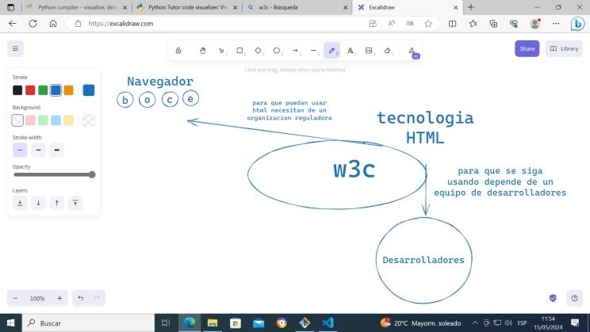
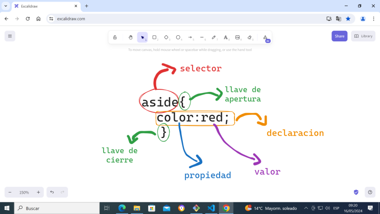

# CSS
## Historia
En un principio era parte de HTML como atributo de tipo estilo y su atributo se llamaba 'style'.
'style' se usaba para darle estilos como fotmato y color ala etiqueta que hacia uso de este atributo.
´style' este atributo se usaba atravez de una lista de caracteristicas de caracteristica se integraba por una clave y un valor 'clave:valor'
**ejemplo**
```css
<h1 style="color:red;font-size:45px" >hola amigos</h1>

```


w3c→  es una organizacion   que regulariza estandares  el uso de las versiones en todos los navegadores 

### CSS EL PRONCIPIO

Se separa parte del equipo de HTML par ala creacion y mantenimiento de una nueva tecnologia ala l que llamas 'CSS' (Cascadin style shee -  hojas de estilo en cacada).
y la raiz de esta separacion se crea en la primera version de esta tecnologia las etiquetas '<style></style>'.

**EJEMPLO**
```css
<style> 
h1{
    color:red;
    font-size:45px


}
</style>

<h1>hola joven</h1>
```
>[!NOTE]

> En la actualidad cuando se usa 'STYLE' como atributo se le dice qeu estamos usando 'css en linea css inline'. y cuando se usa '<style></style> como etiqueta se dice que estamos usando ' css en enbedidos - css blouquete'


## renderisado  
 es  la accion  que hace el navegador que hace navegador para mostrar el contenido de la pagina web.





# unidades de medida de css tareañas 

averiguar flexbox y greed   → sirbe para ubicar nuestras cvjas

flex wrap → para salto de pajna